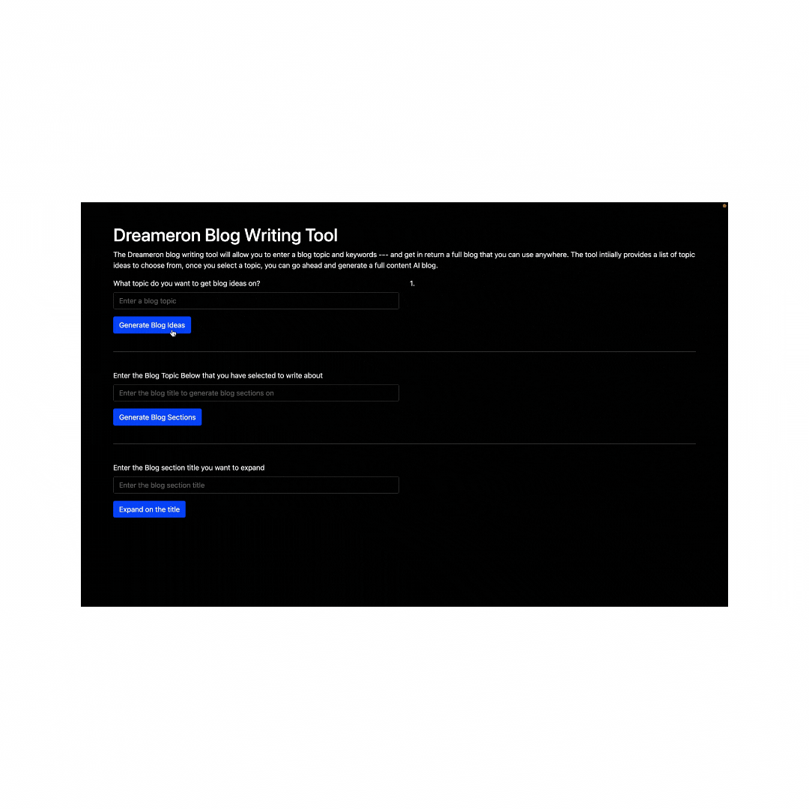

# Blogging with OPENAI api

An introduction to OPENAI library api.

## HomeScreen

## Features

- generates content for blogs
- user friendly
- easy to use

## 💻 Technologies and 🛠️ tools:

<code></code>
<code></code>
<code></code>

## Acknowledgements

- [Awesome Readme Templates](https://awesomeopensource.com/project/elangosundar/awesome-README-templates)
- [Awesome README](https://github.com/matiassingers/awesome-readme)
- [How to write a Good readme](https://bulldogjob.com/news/449-how-to-write-a-good-readme-for-your-github-project)

<!-- ## Optimizations

What optimizations did you make in your code? E.g. refactors, performance improvements, accessibility -->

## Roadmap

- Additional browser support

- Add more integrations
